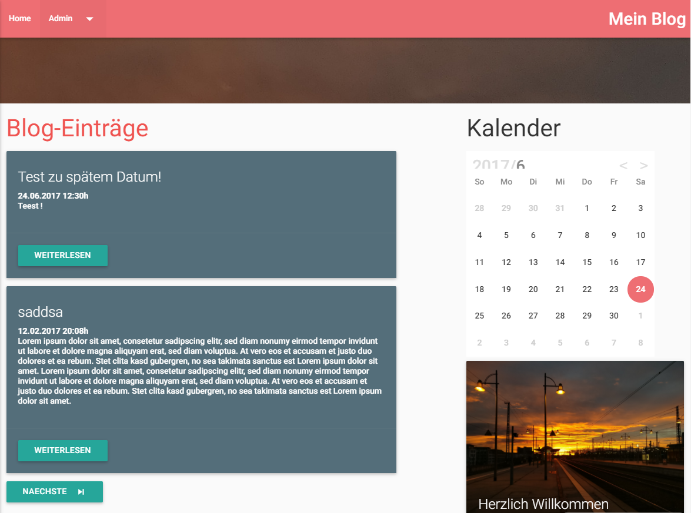

# IT-Blog
A small blog engine for a school project written in PHP

Sources:
 [MaterializeCSS](http://materializecss.com/)
 [SimpleMDE](https://simplemde.com/)
 [Markdown Parser](https://github.com/michelf/php-markdown)
 [Upload Script](http://www.w3schools.com/php/php_file_upload.asp)
 [Calendar](https://github.com/yscoder/Calendar)
 
 
 
 [Try for yourself](https://dansblog.000webhostapp.com/index.php) 
